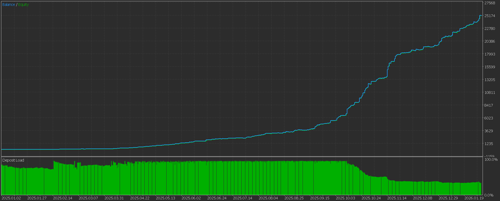
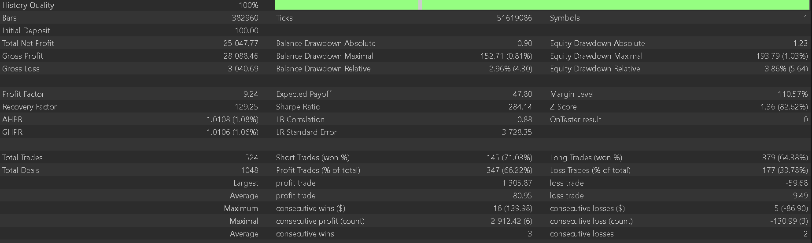

# AI TradingVision GPX

**Professional MT5 Expert Advisor for GBPUSD & Gold (XAUUSD) Multi-Timeframe Trend Strategy with Strict Risk Control**

---

## Overview

AI TradingVision GPX is a MetaTrader 5 Expert Advisor designed for **GBPUSD** and **Gold (XAUUSD)** on the **M1** timeframe. It uses a multi-timeframe trend approach (M1 + M5 + H4) with moving averages, session filters, and strong risk management to target consistent growth with controlled drawdown. The EA works best on both Forex (GBPUSD) and Gold (XAUUSD).

---

## Backtest Results

**Gold (XAUUSD) — $100 Initial Deposit | 2025.01.01 – 2026.01.19**

  

  

---

## Performance Highlights

**Gold (XAUUSD) — $100 Initial Deposit**

| Metric | Result |
|--------|--------|
| **Test Period** | 2025.01.01 – 2026.01.19 (~13 months) |
| **Symbol / Timeframe** | XAUUSD (Gold), M1 |
| **Initial Deposit** | $100 |
| **Total Net Profit** | $25,047.77 |
| **Balance Drawdown Maximal** | $152.71 (0.81%) |
| **Equity Drawdown Maximal** | $193.79 (1.03%) |
| **Profit Factor** | 9.24 |
| **Recovery Factor** | 129.25 |
| **Total Trades** | 524 |
| **Win Rate** | 66.22% |
| **Expected Payoff** | $47.80 per trade |
| **Average Profit Trade** | $80.95 |
| **Average Loss Trade** | -$9.49 |

*Results from backtest (Every tick model); live/demo results may vary by broker, spread, and market conditions.*

---

## Key Features

- **Multi-timeframe filter** — M1, M5, and H4 alignment for higher-probability trend entries  
- **Session-based trading** — London AM (9–11) and NY (14–17) for liquid hours  
- **Trailing stop** — Locks in profit as the market moves in your favor  
- **Breakeven** — Moves SL to entry after small profit to protect capital  
- **Early exit for losers** — Cuts losing trades at a preset loss level to limit drawdown  
- **Drawdown limits** — Stops new entries when total or daily drawdown exceeds set %  
- **Margin-aware lot sizing** — Caps lots when deposit is small so trades open without margin errors  
- **Time-based close** — Closes all positions at a fixed time (e.g. 02:00) for clean daily reset  

---

## Requirements

- **Platform:** MetaTrader 5 (MT5 only)  
- **Symbol:** GBPUSD or XAUUSD (Gold) — both optimised  
- **Timeframe:** M1  
- **Model:** Every tick (for backtesting)  
- **Deposit:** 3000+ (1:100) recommended for full lot; EA auto-reduces lots on smaller accounts  

---

## Quick Start

1. Copy **AI_TradingVision_GPX_Clone.ex5** to `MQL5/Experts/`
2. Restart MT5 or refresh Navigator
3. Attach to a **GBPUSD** or **XAUUSD (Gold)** M1 chart
4. Enable **AutoTrading** (green button in toolbar)

## Disclaimer

Trading forex and commodities involves risk. Past backtest performance does not guarantee future results. Use on demo first and only risk capital you can afford to lose.

---

*AI TradingVision GPX — Built for disciplined, rule-based trend trading.*
